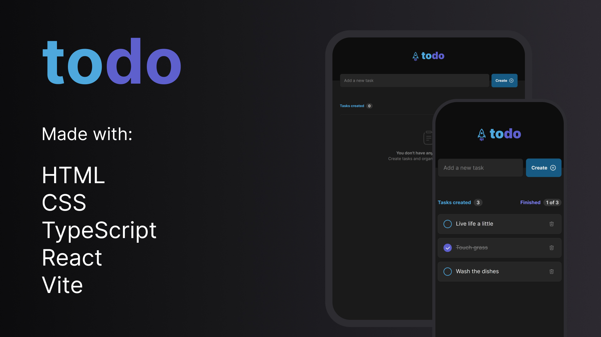

<h1 align="center"> Todo React TS </h1>

Perhaps the quintessential project for beginners, this is yet another todo app.

Check it out live <a href="https://todo-react-ts-orpin.vercel.app/">here</a>!

  <a href="#technologies">Technologies</a>&nbsp;&nbsp;&nbsp;|&nbsp;&nbsp;&nbsp;
  <a href="#project">Project</a>&nbsp;&nbsp;&nbsp;|&nbsp;&nbsp;&nbsp;
  <a href="#learnings">Learnings</a>&nbsp;&nbsp;&nbsp;

  

## Technologies

- HTML
- CSS (CSS Modules)
- TypeScript
- React
- Vite
- Git & Github (lol)
- Figma

## Project

I was feeling a little bit left behind by not having a todo app in my github so I decided to create one! Even though it is a fairly beginner project, I believe this is the first time that I've done it with TypeScript and Vite. Quite interesting!

## Learnings

I have been a little rusty on the TypeScript front so this project was very good for me to learn how to type HTML element-based events properly and to remember how to style a checkbox manually.

Vite is cool and it is definitely a step up from the old `create-react-app`. As of today, I can see myself using this in situations where Next JS would be a bit overkill (such as this project).
